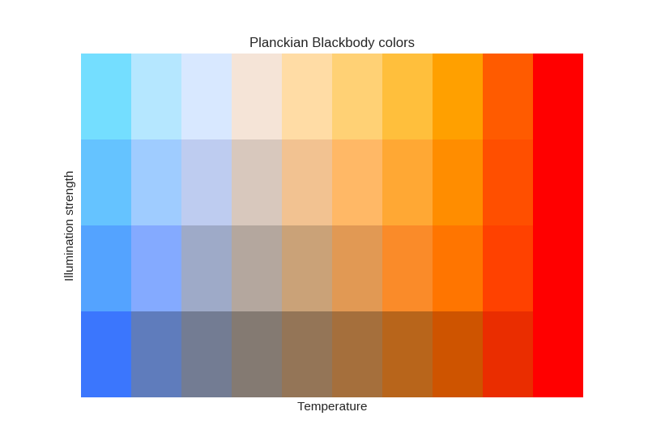

This script approximates the Planckian Blackbody-Locus using a polygon in the CIE-space,
samples at certain intervals (specifiable) and for different illumination strengths,
and calculates the RGB-Values. It outputs a plot as well as a textual representation of the color-values
that can be used as a lookup-table.

`
colors = [
    [0.23157904157559389, 0.46428251996886288, 0.99142925079930599] ,
    [0.3733398508355843, 0.48526932616067181, 0.73821064704467443] ,
    [0.45113374718414939, 0.48588273598512927, 0.574943960090048] ,
    [0.51602608511753645, 0.47714957175815237, 0.44897982121609553] ,
    [0.57917224428042735, 0.46077718150619779, 0.33960627010071198] ,
    [0.64582139352367074, 0.43526975385270156, 0.2333916241385684] ,
    [0.72023966594375988, 0.39571424047528636, 0.10764851891555022] ,
    [0.80760711386235251, 0.32883728391730765, 0.0] ,
    [0.91601340780061957, 0.17615934753746126, 0.0] ,
    [1.0, 0.0, 0.0] ,
    [0.327537126064954, 0.63815900322828478, 1.0] ,
    [0.51676510402458564, 0.66617302854485383, 1.0] ,
    [0.62060749728182296, 0.66699183242547921, 0.78587430382189349] ,
    [0.70722837618557799, 0.65533445676229829, 0.61773235105673285] ,
    [0.79151838607396907, 0.63347993774596445, 0.47173617603581558] ,
    [0.88048432673037691, 0.5994316067367188, 0.32995663350898596] ,
    [0.97982080263519478, 0.5466313310283889, 0.16210972527020515] ,
    [1.0, 0.457361304089201, 0.0] ,
    [1.0, 0.25356070975694511, 0.0] ,
    [1.0, 0.0, 0.0] ,
    [0.39794445642141096, 0.7657374043938745, 1.0] ,
    [0.62200052255627014, 0.79890751156677786, 1.0] ,
    [0.74495548081412921, 0.79987701923898902, 0.94064023597194424] ,
    [0.84751924322171346, 0.78607406176561934, 0.74155115361208279] ,
    [0.94732313180995498, 0.76019714012396933, 0.56868385883550665] ,
    [1.0, 0.71988209164833339, 0.4008092828901984] ,
    [1.0, 0.65736373578148555, 0.20206954906023233] ,
    [1.0, 0.55166324013905832, 0.0] ,
    [1.0, 0.3103524153107507, 0.0] ,
    [1.0, 0.0, 0.0] ,
    [0.45562580157116722, 0.87025626278589019, 1.0] ,
    [0.70821484807569246, 0.90765050025417471, 1.0] ,
    [0.84682781314785038, 0.90874347230678254, 1.0] ,
    [0.96245281451181908, 0.89318274267653686, 0.84298995338003369] ,
    [1.0, 0.86401045969981749, 0.64810844040572957] ,
    [1.0, 0.81856139050070298, 0.45885545653492227] ,
    [1.0, 0.74808147817405835, 0.23480671401857683] ,
    [1.0, 0.62892028843279768, 0.0] ,
    [1.0, 0.35687913281456285, 0.0] ,
    [1.0, 0.0, 0.0] ,
]
`
